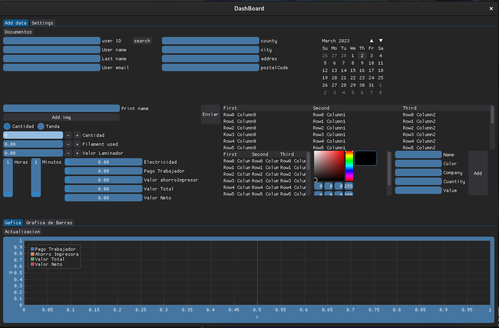
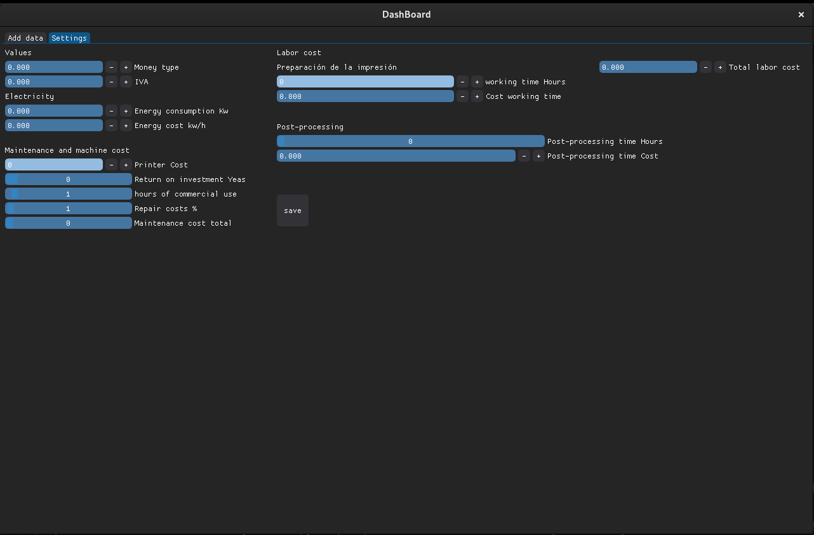

# Print3D UI

## Información

Esta diseñado para ayudar a la gestión de ventas de impresiones 3D 
- Grafica de :
	- Venta de impresiones 
- 

### Librerías 
- *Dearpygui*: Diseño de la aplicación 
- *Sqlitle*: Estructura la base de datos

## Uso 

- 1 Activar el entrono virtual 
~~~shell
python -m venv venv
source venv/bin/activate  
~~~

o 

- En Windows 
~~~shell
usa venv\Scripts\activate
~~~

Despues ejecutar los requerimientos 
~~~shell
pip install -r requirements.txt
~~~

- 2 Ejecutar la aplicación 
~~~shell
python3 Print3D_UI.py
~~~

